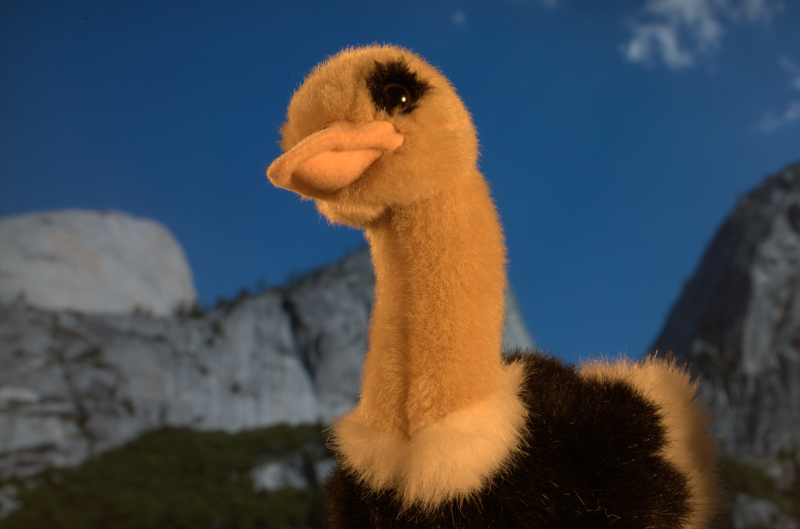
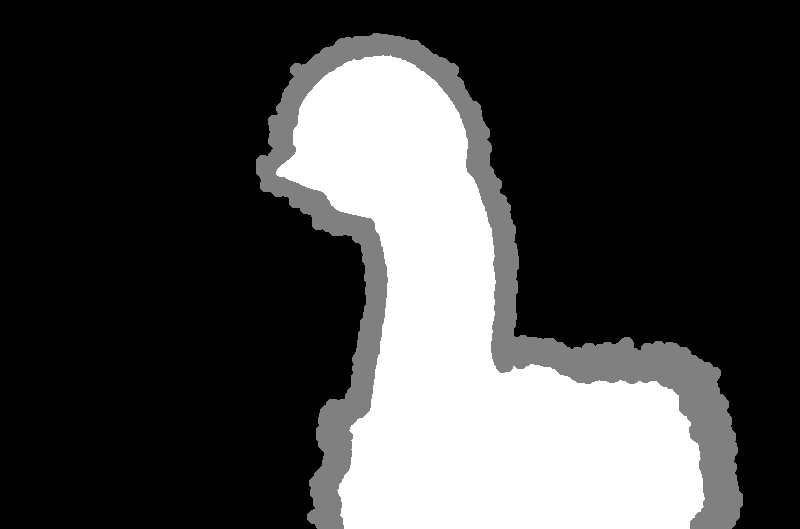
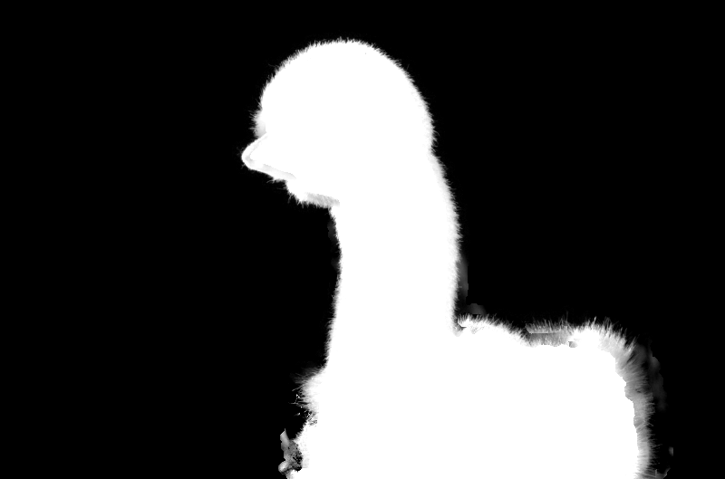
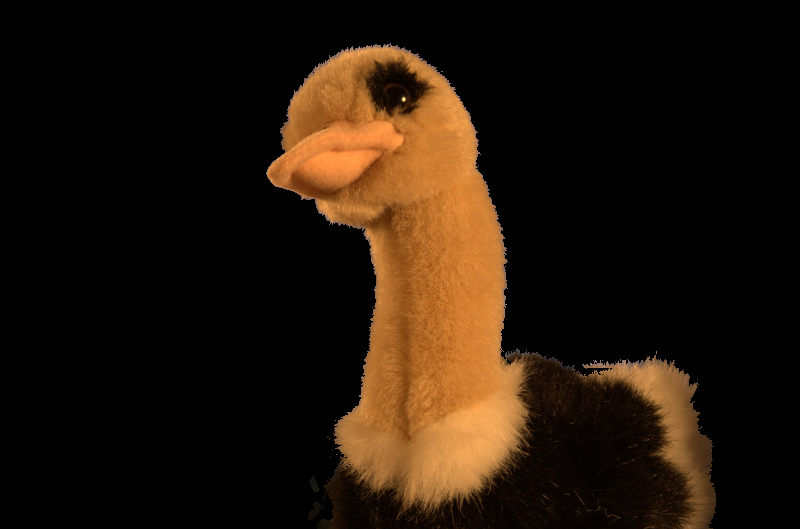
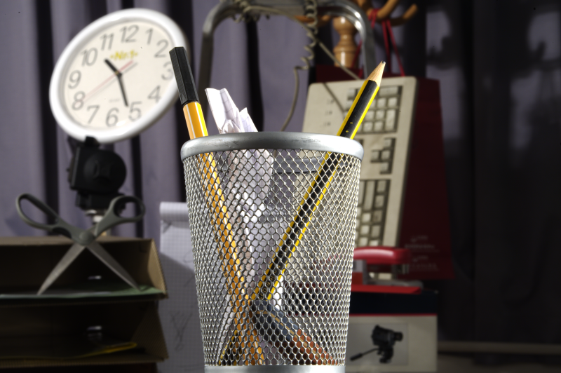
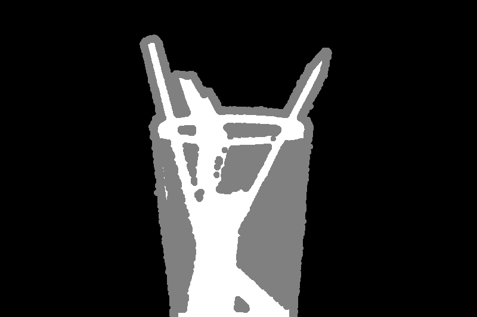
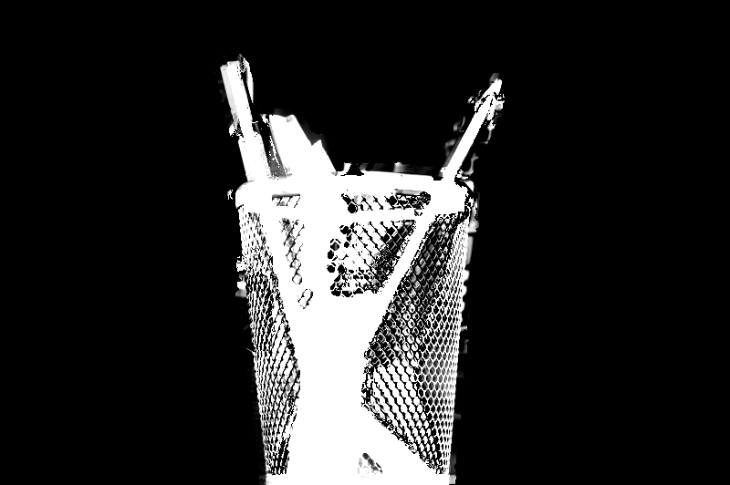
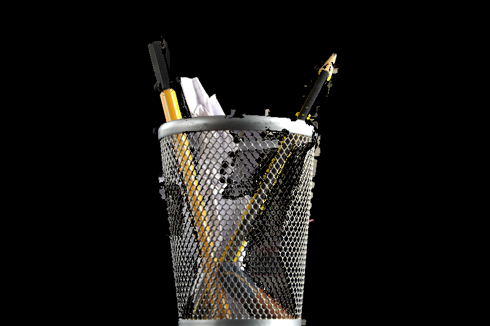

# Assignment-3 EE321 Probability and Random Processes

This repository was made as an assignment for the FALL2020 course EE321. In this project we demonstrate the Bayesian Matting Algorithm which was first introduced in the paper ["A Bayesian Approach to Digital Matting"](https://grail.cs.washington.edu/projects/digital-matting/image-matting/)

## Table of contents

- [Problem Statement](#problem-statement)
- [Background](#background)
- [Dataset](#dataset)
- [Technologies](#technologies)
- [Setup](#setup)
- [Results](#results)
- [References](#references)

## Problem Statement

Image Matting is the process of accurately estimating the foreground object in images and videos. It is a very important technique in image and video editing applications, particularly in film production for creating visual effects. In order to fully separate the foreground from the background in an image, accurate estimation of the alpha values for partial or mixed pixels is necessary. Bayesian matting models both the foreground and background color distributions with spatially-varying mixtures of Gaussians, and assumes a fractional blending of the foreground and background colors to produce the final output. It then uses a maximum-likelihood criterion to estimate the optimal opacity, foreground and background simultaneously. The goal of this assignment is for you to understand the real life implications of theory that are covered in the class. The task is to implement bayesian matting in python.

## Background

This Bayesian framework for solving the matting problem, is based on extracting the foreground element from a backgound image by estimating an opacity for each pixel (Alpha) of the foreground element. In this approach they model both the foreground and background pixels as colour distributions spatially-varying mixtures of Gaussians and assume a fractional blending of the foreground and background colours to produce the final output. It uses a maximum likelihood estimation criteria to estimate the optimal opacity or alpha at a given pixel.

## Dataset

We were provided the ALpha Matting Dataset, which can be found on their [website](http://www.alphamatting.com/index.html)

The Input images are [here](http://www.alphamatting.com/datasets/zip/input_training_lowres.zip).

The Trimap images are [here](http://www.alphamatting.com/datasets/zip/trimap_training_lowres.zip).

The Ground truth alpha images are [here](http://www.alphamatting.com/datasets/zip/gt_training_lowres.zip).

The dataset contains 27 images, with their trimaps and ground truth alpha mattes.

## Technologies

The project uses Python >= 3.5

Other technologies used

- Jupyter Notebook
- OpenCV
- Pillow
- Matplotlib
- Numpy

##### \* The project is also compatible with [Google Colabaratory](https://colab.research.google.com/)

## Setup

This project tries to implement the algorithm introduced by the CV2001 paper.
The main algorithm is implemented in the [BayesianMatting.ipynb](https://github.com/varunjain3/BayesianMatting/blob/main/BayesianMatting.ipynb) and can be also opened in [Google Colaboratory](https://colab.research.google.com/github/varunjain3/BayesianMatting/blob/main/BayesianMatting.ipynb)

This code is highly inspired from [MarcoForte](https://github.com/MarcoForte)'s code on [Bayesian Matting](https://github.com/MarcoForte/bayesian-matting). Do have a look!

The cells can be executed in the Jupyter Notebooks after all the dependencies are installed.

## Results

After Running the algorithm on each image we get -
| Sample Name | Absolute Difference Between Ground Truth |
|:-----------:|------------------------------------------|
| GT01 | 1.11 |
| GT02 | 2.43 |
| GT03 | 7.56 |
| GT04 | 10.63|
| GT05 | 0.99 |
| GT06 | 2.24 |
| GT07 | 1.81 |
| GT08 | 14.72 |
| GT09 | 2.85 |
| GT10 | 3.65 |
| GT11 | 4.77 |
| GT12 | 1.44 |
| GT13 | 9.99 |
| GT14 | 1.90 |
| GT15 | 3.29 |
| GT16 | 19.67 |
| GT17 | 2.27 |
| GT18 | 2.70 |
| GT19 | 11.50 |
| GT20 | 1.58 |
| GT21 | 5.94 |
| GT22 | 2.81|
| GT23 | 2.19 |
| GT24 | 5.66 |
| GT25 | 13.6 |
| GT26 | 17.58 |
| GT27 | 9.99 |
| Average |6.10 |

### Here are some of the examples -

#### For GT14-

The Input Image -

The Trimap Image -

The Solved Alpha Matte -

Finnaly, The mask over the orignal image -

#### For GT25-

The Input Image -

The Trimap Image -

The Solved Alpha Matte -

Finnaly, The mask over the orignal image -

## References

[1] Yung-Yu Chuang, Brian Curless, David H. Salesin, and Richard Szeliski. A Bayesian Approach to Digital Matting. In Proceedings of IEEE Computer Vision and Pattern Recognition (CVPR 2001), Vol. II, 264-271, December 2001

[2] Christoph Rhemann, Carsten Rother, Jue Wang, Margrit Gelautz, Pushmeet Kohli, Pamela Rott. A Perceptually Motivated Online Benchmark for Image Matting.
Conference on Computer Vision and Pattern Recognition (CVPR), June 2009.
